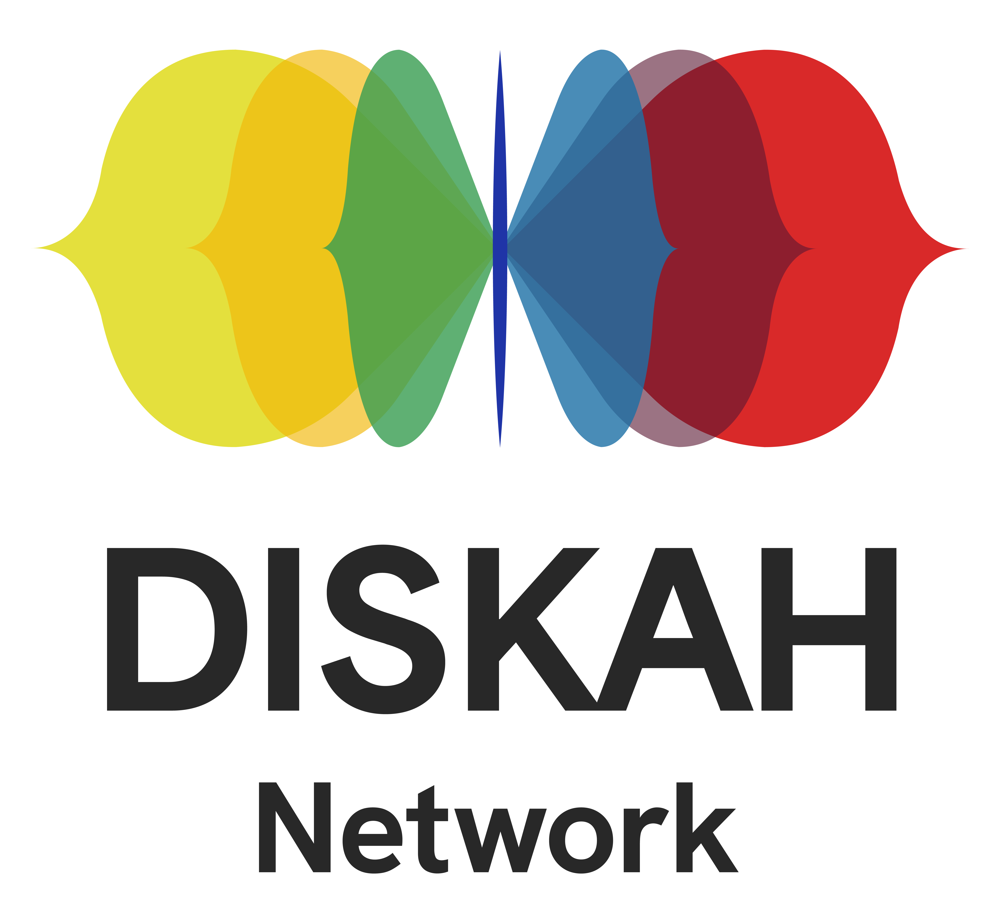

This resource is built with [The Carpentries Workbench](https://carpentries.github.io/sandpaper-docs/), as part of the training activities of the [UKRI-funded Digital Skills in Arts and Humanities (DISKAH) Network](https://www.culturedigitalskills.org). 

{width=50% alt="logo"}

### DOI  

